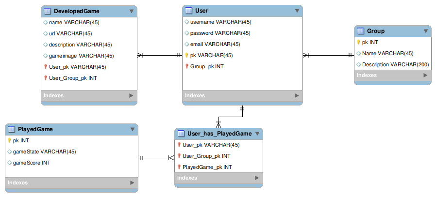

#Project Plan
------

**1. Team**

660835 Laxmi Thebe
643645 Filippo Vimini
428514 Carl Bostrom

**2. Goal**

In this project, we will create a simple but functional website that allows to play and sell games. Developer will be able to link their games into the website and set a price for the sell. Gamers will be able to buy the games and play directly in the website. The Website will create a game library for each user and collects some basic statistics about the games.  

**3. Plans**

The backend will be implemented using Django. We will begin by setting up a logging system and a documentation system using Sphinx, to aid development. Thereafter the management and authentication of user accounts. The payment system will be replaced with a simple on server toggle while the core functionality is implemented. The tests and the security will be implemented while proper fnctionalities are created.

We will use jQuery and Bootstrap to make the UI responsive and mobile friendly. The frontend scripts will be written with Typescript. To keep things simple GNU Make will do as our build system. We will begin working on design right from the start, with continuous testing to ensure that it works on mobile. Unit testing for the frontend scripts will be done using AVA.

**3.1 Models**

**ER-Diagram**

The diagram is more about the concept and actual representation of the relationship than exact definition of attributes.

**3.2 Views**

* Home (/)
  The home view will present the players with a splash screen, and options for signing up, signing in, searching for games, and if the user is logged in, presents the user with her game catalogue.
* Signup (/signup)
  The signup screen.
* Login (/login)
  The login screen.
* Search (/search)
  This view presents the user with the results of a search query. The query itself is passed as a GET parameter. Clicking on a game should redirect the user to the BuyGame view.
* BuyGame (/buy)
  This view gives the player a presentation/description of the game, and asks the player to buy it.
* UploadGame (/upload)
  Developers go through this view to upload a game.
* PlayGame (/play)
  Here the playing takes place.
* ConfirmPayment (/confirm)
  Paying for a game will be done from the BuyGame view. This view implements the backend part of the payment flow.

**3.3 Extra features**

After the basic functionality is implemented, we will implement the following extra features depending on what time permits. These are ranked by priority.

* Better search functionality. A tag system would be helpful.
* Social media sharing.
* REST API. Using django rest\_framework this should not be difficult. This will allow for getting statistics about players, developers and games straight from the database.
* Recommendation system. This one might be difficult to implement, we'll see.

**4. Process and Time Schedule**

We communicate using the messagging application Slack. Most work will be done remotely due to divergent schedules of teammates. To ensure code quality will will require that feature branches are merged not by the developer behind the feature. This will work as a simple code review process.

* 25.12-30.12:
  Development begins. We set up logging and documentation system and begin working on the backend, starting with authentication.
* 1.1-21.1:
  We begin work on the frontend design, with continuous testing on phone. Most core features should be implemented during this time.
* 28.1-5.2:
  Polish for the frontend. The payment system should be implemented this week. If time permits we begin implementing tag system here.
* 5.2-20.2:
  Assuming everything else works we use this time to implement extra features, and test the final product.

**5. Testing**

The backend will have tests for all views and all response cases. For the frontend we will use AVA. To ensure code quality we require all features must have unit tests before merging to master.

The testing of the frontend will be done continuously during development, both on desktop and phone. During the last week we will do a final test of the apps security.

**6. Risk Analysis**

